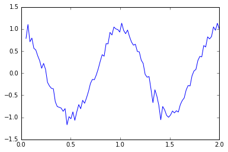
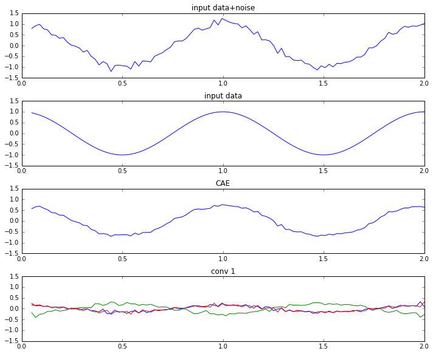

CAE를 이용해서 wavelet변환의 mother wavelet 역할을 하는 친구를 찾아보자


```python
import matplotlib.pyplot as plt
import numpy as np
import math
import tensorflow as tf
import os
import tensorflow.examples.tutorials.mnist.input_data as input_data
from sklearn.utils import shuffle
%matplotlib inline 

```

# 1. 이미지 예제 


참고 : https://github.com/sjchoi86/tensorflow-101/blob/master/notebooks/cae_mnist.ipynb

이분의 이미지 auto encoder 코드를 그대로 가져와서 이미지예제를 실행해봄

특징 : training과정에서 test이미지를 모델에 넣어서 CAE모델이 학습된 feature를 이용해서 이미지를 다시 잘 만들어내는지 봄

## 1.1. 이미지 불러오기


```python
mnist = input_data.read_data_sets("data/", one_hot=True)
trainimgs   = mnist.train.images
trainlabels = mnist.train.labels
testimgs    = mnist.test.images
testlabels  = mnist.test.labels
ntrain      = trainimgs.shape[0]
ntest       = testimgs.shape[0]
dim         = trainimgs.shape[1]
nout        = trainlabels.shape[1]
print ("Packages loaded")
```

    Successfully downloaded train-images-idx3-ubyte.gz 9912422 bytes.
    Extracting data/train-images-idx3-ubyte.gz
    Successfully downloaded train-labels-idx1-ubyte.gz 28881 bytes.
    Extracting data/train-labels-idx1-ubyte.gz
    Successfully downloaded t10k-images-idx3-ubyte.gz 1648877 bytes.
    Extracting data/t10k-images-idx3-ubyte.gz
    Successfully downloaded t10k-labels-idx1-ubyte.gz 4542 bytes.
    Extracting data/t10k-labels-idx1-ubyte.gz
    Packages loaded


## 1.2. Define Network

- convolution layer와 bias에 들어갈 변수를 초기화 한다. 
- random_normal로 초기화
- 제일 헷갈리는 파라미터의 dimension
    - ksize, ksize, 1, n1
    - 순서대로 x축, y축, input channel, output channel 이다


```python
n1 = 16
n2 = 32
n3 = 64
ksize = 5
weights = {
    'ce1': tf.Variable(tf.random_normal([ksize, ksize, 1, n1],  stddev=0.1)),
    'ce2': tf.Variable(tf.random_normal([ksize, ksize, n1, n2], stddev=0.1)),
    'ce3': tf.Variable(tf.random_normal([ksize, ksize, n2, n3], stddev=0.1)),
    'cd3': tf.Variable(tf.random_normal([ksize, ksize, n2, n3], stddev=0.1)),
    'cd2': tf.Variable(tf.random_normal([ksize, ksize, n1, n2], stddev=0.1)),
    'cd1': tf.Variable(tf.random_normal([ksize, ksize, 1, n1],  stddev=0.1))
}
biases = {
    'be1': tf.Variable(tf.random_normal([n1], stddev=0.1)),
    'be2': tf.Variable(tf.random_normal([n2], stddev=0.1)),
    'be3': tf.Variable(tf.random_normal([n3], stddev=0.1)),
    'bd3': tf.Variable(tf.random_normal([n2], stddev=0.1)),
    'bd2': tf.Variable(tf.random_normal([n1], stddev=0.1)),
    'bd1': tf.Variable(tf.random_normal([1],  stddev=0.1))
}
```

- 레이어의 구성은 딱 두가지, convolution layer, deconvolution layer
    - convolution layer는 세개이고, 바꿀 수 있는 주요 parameter는 stride, padding
    
- 사실 실제로 convolution, deconvolution layer를 구성하기 위해서는 아래 식을 이용해서 convolution layer를 지나고 나면 크기가 어떻게 변화할지 예상해야한다.
    $$\frac{N(input 크기)-F(padding)}{S(stride)} + 1$$


```python
def cae(_X, _W, _b, _keepprob):
    _input_r = tf.reshape(_X, shape=[-1, 28, 28, 1])
    # Encoder
    _ce1 = tf.nn.sigmoid(tf.add(tf.nn.conv2d(_input_r, _W['ce1']
        , strides=[1, 2, 2, 1], padding='SAME'), _b['be1']))
    _ce1 = tf.nn.dropout(_ce1, _keepprob)
    _ce2 = tf.nn.sigmoid(tf.add(tf.nn.conv2d(_ce1, _W['ce2']
        , strides=[1, 2, 2, 1], padding='SAME'), _b['be2'])) 
    _ce2 = tf.nn.dropout(_ce2, _keepprob)
    _ce3 = tf.nn.sigmoid(tf.add(tf.nn.conv2d(_ce2, _W['ce3']
        , strides=[1, 2, 2, 1], padding='SAME'), _b['be3'])) 
    _ce1 = tf.nn.dropout(_ce3, _keepprob)
    # Decoder
    _cd3 = tf.nn.sigmoid(tf.add(tf.nn.conv2d_transpose(_ce3, _W['cd3']
        , tf.pack([tf.shape(_X)[0], 7, 7, n2]), strides=[1, 2, 2, 1]
        , padding='SAME'), _b['bd3'])) 
    _cd3 = tf.nn.dropout(_cd3, _keepprob)
    _cd2 = tf.nn.sigmoid(tf.add(tf.nn.conv2d_transpose(_cd3, _W['cd2']
        , tf.pack([tf.shape(_X)[0], 14, 14, n1]), strides=[1, 2, 2, 1]
        , padding='SAME') , _b['bd2'])) 
    _cd2 = tf.nn.dropout(_cd2, _keepprob)
    _cd1 = tf.nn.sigmoid(tf.add(tf.nn.conv2d_transpose(_cd2, _W['cd1']
        , tf.pack([tf.shape(_X)[0], 28, 28, 1]), strides=[1, 2, 2, 1]
        , padding='SAME'), _b['bd1'])) 
    _cd1 = tf.nn.dropout(_cd1, _keepprob)
    _out = _cd1
    return {'input_r': _input_r, 'ce1': _ce1, 'ce2': _ce2, 'ce3': _ce3
        , 'cd3': _cd3, 'cd2': _cd2, 'cd1': _cd1
        , 'layers': (_input_r, _ce1, _ce2, _ce3, _cd3, _cd2, _cd1)
        , 'out': _out}
print ("Network ready")

```

    Network ready


## 1.3. Cost Function

- 학습을 위한 cost function 정의


```python
x = tf.placeholder(tf.float32, [None, dim])
y = tf.placeholder(tf.float32, [None, dim])
keepprob = tf.placeholder(tf.float32)
pred = cae(x, weights, biases, keepprob)['out']
cost = tf.reduce_sum(tf.square(cae(x, weights, biases, keepprob)['out'] 
            - tf.reshape(y, shape=[-1, 28, 28, 1])))
learning_rate = 0.001
optm = tf.train.AdamOptimizer(learning_rate).minimize(cost)
init = tf.initialize_all_variables()
print ("Functions ready")
```

    Functions ready


## 1.4. training

- 이 코드에 포함된것
    - batch gradient descent
    - batch normalize
    - auto-encoder할때 input에 noise추가
        - 두가지 기대효과과
        1. data argumentation : training 데이터의 수를 매우매우 늘리는 효과
        2. noise에 로버스트

- iteration안에서 학습이 잘되고있나 알고싶어 중간중간 input > CAE > output 비교할 수 있는 코드작성 


```python
sess = tf.Session()
sess.run(init)
# mean_img = np.mean(mnist.train.images, axis=0)
mean_img = np.zeros((784))
# Fit all training data
batch_size = 128
n_epochs   = 5
print("Strart training..")
for epoch_i in range(n_epochs):
    for batch_i in range(mnist.train.num_examples // batch_size):
        batch_xs, _ = mnist.train.next_batch(batch_size)
        trainbatch = np.array([img - mean_img for img in batch_xs])
        trainbatch_noisy = trainbatch + 0.3*np.random.randn(
            trainbatch.shape[0], 784)
        sess.run(optm, feed_dict={x: trainbatch_noisy
                                  , y: trainbatch, keepprob: 0.7})
    print ("[%02d/%02d] cost: %.4f" % (epoch_i, n_epochs
        , sess.run(cost, feed_dict={x: trainbatch_noisy
                                    , y: trainbatch, keepprob: 1.})))
    if (epoch_i % 1) == 0:
        n_examples = 5
        test_xs, _ = mnist.test.next_batch(n_examples)
        test_xs_noisy = test_xs + 0.3*np.random.randn(
            test_xs.shape[0], 784)
        recon = sess.run(pred, feed_dict={x: test_xs_noisy, keepprob: 1.})
        fig, axs = plt.subplots(2, n_examples, figsize=(15, 4))
        for example_i in range(n_examples):
            axs[0][example_i].matshow(np.reshape(
                test_xs_noisy[example_i, :], (28, 28))
                , cmap=plt.get_cmap('gray'))
            axs[1][example_i].matshow(np.reshape(
                np.reshape(recon[example_i, ...], (784,))
                + mean_img, (28, 28)), cmap=plt.get_cmap('gray'))
        plt.show()
print("Training done. ")
```

    Strart training..
    [00/05] cost: 10682.1055


    [01/05] cost: 7053.6655


    [02/05] cost: 3563.6311


    [03/05] cost: 2776.3281


    [04/05] cost: 2381.3625


    Training done. 


# 2. 신호 예제

우리는 신호로 할꺼니까 cos을 이용해서  신호예제를만들자.

이미지도 신호이긴 하지만, 우리는 input 신호를 ($1\times N$)크기의 신호로 볼 것이다. 


- **기존의 신호처리**의 경우 FFT나 wavelet transform을 통해 신호의 특성을 가장 잘 살리는 형태로 데이터를 변형시켜서 분석을 시행하였다.
특히, wavelet transform은 mother wavelet을 잘 결정한다면 신호처리에 아주 효과적인 방법이라는 것이 알려져있다.
    - wavelet transform은 mother waverlet을 기반으로 다양한 크기의 wavelet을 만들어 원신호에 convolution 함으로써 주파수대역(scale)에 표현하는 방식이다.
    - 하지만 mother wavelet을 결정해 주어야 하는 단점이 있다.
    - 여기서 idea를 착안하여 convolution neural network로 부터 새로운 정보를 얻어 보고자 한다.
    
- **CNN**의 convolution layer는 이미지를 잘 구분 할 수 있도록 그 형태가 결정된다.
    - 신호에대해서 convolution layer를 학습한다면 network가 데이터를 기반으로 가장 좋은 convolution layer를 만들어 낼 것이다.
    - 이 layer는 앞의 mother wavelet을 이용해 만들어낸 wavelet과 같은 역할을 하는 친구로 해석할 수 있다.


## 2.1. 샘플데이터 생성

- 코사인 함수 + normal 노이즈


```python
X = np.linspace(0.05,2,100)
signal_train = np.cos(2*np.pi*X) + np.random.normal(loc=0.0, scale=0.1, size=(1000,100)) 
signal_test =  np.cos(2*np.pi*X) + np.random.normal(loc=0.0, scale=0.1, size=(200,100)) 
```

어떻게 생겨먹은 샘플인가?


```python
plt.plot(X,signal_train[2,:],'-',mew=1.5)
plt.show()
```





## 2.2. Define Network

-  CNN 모델에 적용하는 것보다는 가능성을 보기위해서는 CAE모델에 학습시켜 convolution이 신호에 대해서 어떤 반응을 보이는지 확인하는 것이 먼저라고 생각하여 CAE모델에 적용
- 특이하게 convolution layer는 단 하나만 주었다. 
    - 우리는 이 모델을 통해서 convolution layer를 이용해 **데이터만으로 mother wavelet**을 만들어 낼 것이다.
    - 그런데 wavelet transform에서 wavelet을 거쳐서 나온 신호에 또 wavelet을 취하는 것은 일반적이지 않다.
        - CNN은 모델의 성능을 최대로 높이기 위해 convolution layer를 여러개 넣는다.
        - 우리는 wavelet 처럼의 **해석**을 빌리기 위해 성능을 조금 포기하고 convolution을 하나만 주었다. (혹은 **병렬로** 길게 convolution layer를 만든다)


```python
n1 = 3
n2 = 1

ksize_x1= 1
ksize_y1 = 5

weights = {
    'ce1': tf.Variable(tf.random_normal([ksize_x1, ksize_y1, 1, n1],  stddev=0.1), name = 'conv1'),
    'cd1': tf.Variable(tf.random_normal([ksize_x1, ksize_y1, 1, n1],  stddev=0.1), name = 'deconv1')
}
biases = {
    'be1': tf.Variable(tf.random_normal([n1], stddev=0.1), name = 'bias1'),
    'bd1': tf.Variable(tf.random_normal([1],  stddev=0.1), name = 'de_bias1')
}

```

- 우리는 _W, _b 즉, 파라미터가 필요하다. (이 친구들이 우리가 알고자 하는 새로운 feature를 만들어줄 친구들)
- 그래서 위의 예제와 다르게 return값을 추가적으로 더 받는다.


```python
def cae(_X, _W, _b, _keepprob):
    with tf.name_scope('input'):
        _input_r = tf.reshape(_X, shape=[-1, 1, 100, 1])
    # Encoder
    with tf.name_scope('convolution'):
        with tf.name_scope('weights'):
            _ce1 = tf.nn.tanh(tf.add(tf.nn.conv2d(_input_r, _W['ce1']
                , strides=[1, 1, 1, 1], padding='SAME'), _b['be1']))
        with tf.name_scope('dropout'):
            _ce1 = tf.nn.dropout(_ce1, _keepprob)

    # Decoder
    with tf.name_scope('deconvolution'):
        with tf.name_scope('weights'):
            _cd1 = tf.nn.tanh(tf.add(tf.nn.conv2d_transpose(_ce1, _W['cd1']
                , tf.pack([tf.shape(_X)[0], 1, 100, 1]), strides=[1, 1, 1, 1]
                , padding='SAME'), _b['bd1'])) 
        with tf.name_scope('dropout'):
            _cd1 = tf.nn.dropout(_cd1, _keepprob)
    with tf.name_scope('output'):   
        _out = _cd1

    return {'input_r': _input_r, 'ce1': _ce1, 'cd1': _cd1
        , 'layers': (_input_r, _ce1, _cd1)
        , 'out': _out}, _W, _b
print ("Network ready")

```

    Network ready


## 2.3. Cost Function

- 이미지 예제와 달라진점
    - `CAE_model, weight_tensor, bias_tensor`
    - 모델의 결과, 파라미터를 모두 받을 것이다.


```python
learning_rate = 0.001
dim = 100
x = tf.placeholder(tf.float32, [None, dim], name = 'input_x')
y = tf.placeholder(tf.float32, [None, dim], name = 'output_y')
keepprob = tf.placeholder(tf.float32, name = 'keepprob')

with tf.name_scope('model'):
    CAE_model, weight_tensor, bias_tensor =  cae(x, weights, biases, keepprob)

with tf.name_scope('train'):
    cost = tf.reduce_sum(tf.square(CAE_model['out'] 
                - tf.reshape(y, shape=[-1, 1, 100, 1])))
    ce_summ = tf.scalar_summary("sum of square", cost)
    optm = tf.train.AdamOptimizer(learning_rate).minimize(cost)
    
with tf.name_scope('accuracy'):
    with tf.name_scope('correct_prediction'):
            correct_prediction = tf.equal(tf.argmax(y, 1), tf.argmax(CAE_model['out'], 1))
    with tf.name_scope('accuracy'):
            accuracy = tf.reduce_mean(tf.cast(correct_prediction, tf.float32))
print ("Functions ready")
```

    Functions ready


## 2.4. Training 
- batch normalize나 noise추가 하는 (생각해보면 부가적인, 성능은 높이는데(overfitting을 피한다던지) 코드는 뺌
- parameter를 tensor에서 꺼내오는 코드 추가
- 그리고 tensorboard를 그리는 코드, model저장하는 코드 추가


```python

init = tf.initialize_all_variables()
# Create a summary to monitor cost tensor
tf.scalar_summary("loss", cost)
# Create a summary to monitor accuracy tensor
tf.scalar_summary("accuracy", accuracy)
# Merge all summaries into a single op
merged = tf.merge_all_summaries()


gpu_options = tf.GPUOptions(per_process_gpu_memory_fraction=0.4)
sess = tf.Session(config=tf.ConfigProto(gpu_options=gpu_options))
with tf.Session() as sess:
    sess.run(init)
    saver = tf.train.Saver()


    #to write logs to Tensorboard
    writer = tf.train.SummaryWriter("./board/test1", graph=tf.get_default_graph())

    # Fit all training data
    n_epochs   = 10
    print("Strart training..")


    #epoch는 시그날의 수 * number of epoch로
    for epoch_i in range(n_epochs*signal_train.shape[0]):

        train_batch = shuffle(signal_train, n_samples = 1)
        sess.run(optm, feed_dict={x: train_batch
                                  , y: train_batch, keepprob: 0.7})

        if (epoch_i % signal_train.shape[0]) == 0:
            print ("[%02d/%02d] cost: %.4f" % (epoch_i, n_epochs*signal_train.shape[0]
            , sess.run( cost, feed_dict={x: train_batch
                                        , y: train_batch, keepprob: 1.})))
            summary, acc = sess.run([merged, accuracy], feed_dict={x: signal_test
                                                                   , y: signal_test, keepprob: 1.})
            writer.add_summary(summary, epoch_i)
            print('Accuracy at step %s: %s' % (epoch_i, acc))


    #모델에서 생기는 결과값, 파라미터 변수에 넣기
    model = sess.run(CAE_model, feed_dict={x: signal_test, keepprob: 1.})
    recon = model['out']
    reconv1 = model['ce1']
    weights = sess.run(weight_tensor, feed_dict={x: signal_test, keepprob: 1.})
    bias = sess.run(bias_tensor, feed_dict={x: signal_test, keepprob: 1.})

    print ("save result...")

    print("Training done... ")
```

    Strart training..
    [00/10000] cost: 49.2761
    Accuracy at step 0: 0.0350001
    [1000/10000] cost: 6.0696
    Accuracy at step 1000: 0.0350001
    [2000/10000] cost: 5.0791
    Accuracy at step 2000: 0.0350001
    [3000/10000] cost: 4.8641
    Accuracy at step 3000: 0.0350001
    [4000/10000] cost: 4.8918
    Accuracy at step 4000: 0.0350001
    [5000/10000] cost: 5.0981
    Accuracy at step 5000: 0.0350001
    [6000/10000] cost: 4.8166
    Accuracy at step 6000: 0.0350001
    [7000/10000] cost: 4.9118
    Accuracy at step 7000: 0.0350001
    [8000/10000] cost: 5.8013
    Accuracy at step 8000: 0.0350001
    [9000/10000] cost: 5.1111
    Accuracy at step 9000: 0.0350001
    save result...
    Training done... 


- 얘네가 wavelet의 maxican hat wavelet과 뭔가 비슷하게 나오는것 같다.


```python
plt.plot(weights['ce1'][:,:,:,0].reshape(5))
plt.plot(weights['ce1'][:,:,:,1].reshape(5))
plt.plot(weights['ce1'][:,:,:,2].reshape(5))
plt.show()
```


```python
fig = plt.figure(figsize = (10, 10))
ax1 = fig.add_subplot(5, 1, 1, title = "input data+noise", ylim = (-1.5, 1.5))
ax1.plot(X, signal_test[0, :])

ax2 = fig.add_subplot(5, 1, 2, title = "input data", ylim = (-1.5, 1.5))
ax2.plot(X, np.cos(2*np.pi*X))

ax3 = fig.add_subplot(5, 1, 3, title = "CAE", ylim = (-1.5, 1.5))
ax3.plot(X, recon[0, :].reshape(100))

ax4 = fig.add_subplot(5, 1, 4, title = "conv 1", ylim =(-1.5, 1.5))
ax4.plot(X, reconv1[0, :, :, 0].reshape(100))
ax4.plot(X, reconv1[0, :, :, 1].reshape(100))
ax4.plot(X, reconv1[0, :, :, 2].reshape(100))
plt.tight_layout()
```





** 복잡하고, 성능이 좋은 동시에 현상을 설명할 수 있는 근거가 될 수 있었으면....**

- 데이터 분석 결과 만들어진 모델의 성능이 아주 좋은것도 중요하지만, 실무에 적용할 때는 그와 같은 결정을 내리는 과정, 원인을 해석하는 것 역시 중요하다. (대표적인 예로 결함 문제의 경우 구분하는것도 중요하고, 원인을 찾아내는 것도 중요하다)
- CAE모델을 신호에 적용하고, 만들어진 convolution을 wavelet처럼 해석한다.
- 이는 CNN모델을 신호에 적용했을 때, 전통적인 방법보다 더 좋은 성능을 내는 동시에 기존의 방식과 흡사하게 현상에 접근할 수 있는 근거가 될 수 있따


```python

```


```python

```
